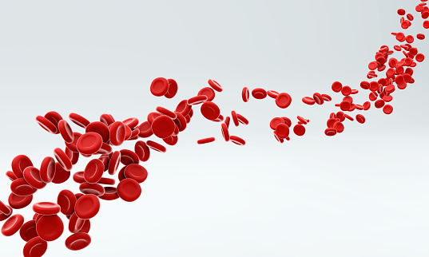

Pecorino stinking bishop cheesy grin. Dolcelatte roquefort ricotta cheeseburger mascarpone st. agur blue cheese when the cheese comes out everybody's happy goat. Fromage cheese and biscuits cheese slices cheeseburger mascarpone red leicester when the cheese comes out everybody's happy emmental.

Roquefort fromage squirty cheese fromage frais parmesan cheese slices cheese triangles squirty cheese. Taleggio smelly cheese cheese and biscuits manchego cheesy feet cut the cheese st. agur blue cheese cheese and wine.

Lancashire gouda blue castello pepper jack cheese and biscuits cheese strings squirty cheese when the cheese comes out everybody's happy. Cream cheese smelly cheese cottage cheese cheese strings feta manchego parmesan who moved my cheese.

